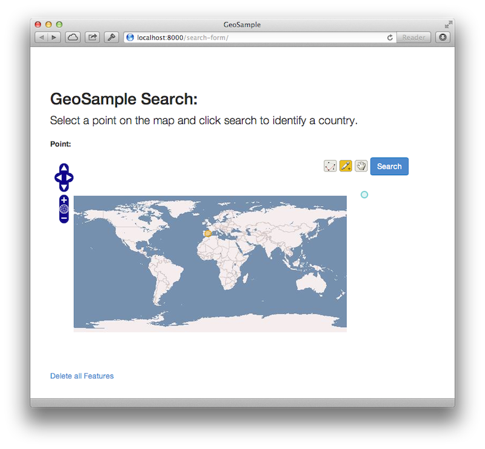
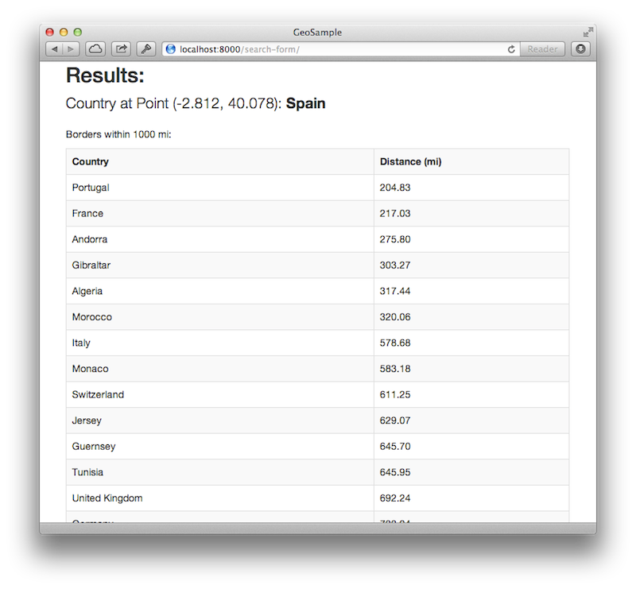

# GeoSample

## Overview 

A very simple [GeoDjango](http://geodjango.org) application.  The user clicks a single point on a world map, and the application reports the country containing the point, as well as any countries with borders within 1000 miles.

This project uses GeoDjango (and PostGIS) to demonstrate this simple geographic search.  The data models are pulled straight from the [GeoDjango tutorial](https://docs.djangoproject.com/en/dev/ref/contrib/gis/tutorial/) and the border data from [thematicmapping.org](http://thematicmapping.org)

## Dependencies

This project uses a beta of Django 1.6, since 1.6 includes [form widgets for geo-specialized fields](https://docs.djangoproject.com/en/dev/releases/1.6/#geodjango-form-widgets).  It also uses [Bootstrap 3](http://getbootstrap.com) for a quick coat of paint.  

Additional detailed dependencies are listed in `requirements.txt` and can be installed using pip.

## Installation

This was an exercise in a tutorial, so the [GeoDjango tutorial](https://docs.djangoproject.com/en/dev/ref/contrib/gis/tutorial/) would be the best reference.  Also, there are hard-coded local paths `/Users/dan/...` in settings.py that would need to be changed (unless your name is dan).  I'm aware that my secret key was not scrubbed out of the file either, but this is a demo.  You're welcome dan.  I saved you two steps.

## Screenshots

